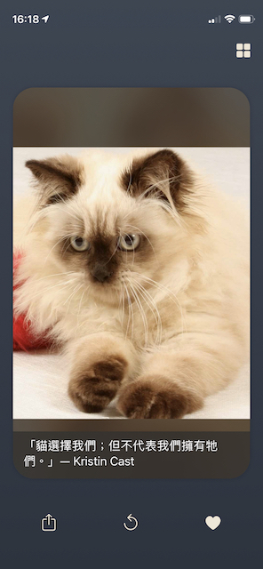

## CatCards: Tinder–like Cat Pictures Browser App
#### Enjoy internet cat pictures using one–finger swiping

###### Demonstration Video: https://youtu.be/Y7D-Lp_HVNc

### Features
* Browse countless cat pictures
* Save pictures and browse saved pictures in the gallery
* Share currently viewed picture or saved one
* Cache: Pictures that were retrieved via the API will be reserved in local cache folder until the maximum cache number is reached
* iPad support
* Dark mode with gradient background
* Language: English, Traditional Chinese
* Onboard session

---
### Specs Overview

* MVC structure
* Restful API
* URLSession
* JSON decoding and parsing
* UserDefaults, Core Data, File Manager
* Cache realized by using File Manager
* UIKit
* AutoLayout
* NSLocalisedString
* Source Version Control: Git
* Unit & UI Test (Currently 71% coverage)

---
### Footnote  
This is the first moderate scale project I've ever built.

All cat images seen in this App are provided by **TheCatAPI**.
Please refer to https://thecatapi.com/ for more info.

If any issue was spotted within this project, feel free to raise an issue ticket and I'll look into it when I get spared time.
